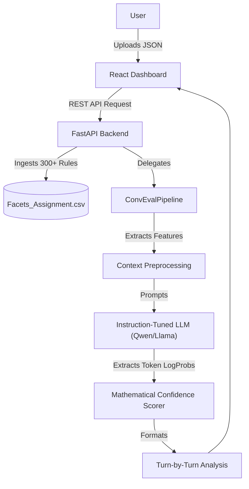

<h1 align="center">ConvEval</h1>

<p align="center">
  <b>The Universal Conversation Evaluation Benchmark.</b>
</p>

<p align="center">
<a href="https://www.python.org/" target="_blank"></a>
<a href="https://react.dev/" target="_blank"></a>
<a href="https://fastapi.tiangolo.com/" target="_blank"></a>
<a href="https://huggingface.co/" target="_blank"></a>
<a href="https://tailwindcss.com/" target="_blank"></a>
<a href="LICENSE" target="_blank"></a>
</p>

---

## 🏗️ System Architecture



---

## 🚀 The Elevator Pitch
**ConvEval** is a production-ready benchmark system designed to automatically and comprehensively evaluate conversational AI agents. It doesn't just give a generic "thumbs up" or "thumbs down"—it deeply analyzes every single conversation turn across 300 distinct facets, ensuring your models are safe, pragmatic, linguistically sound, and emotionally intelligent. 

## ❓ The Why?
In the era of rapid LLM deployment, evaluating conversational AI is famously inconsistent, unscalable, and opaque. Relying on basic heuristic linters or expensive, closed-source APIs like OpenAI for evaluation introduces privacy risks and lacks the granularity needed to actually improve your models.

We built **ConvEval** because evaluation should be strict, scalable, and run entirely within your VPC. By pairing open-weights Instruction-Tuned models with mathematically grounded confidence scoring (derived from token log-probabilities), ConvEval acts as an automated team of 300 highly specialized human annotators analyzing your transcripts 24/7.

## ✨ Feature Highlights

- **📐 300+ Granular Facets**: Evaluates transcripts across Linguistic Quality, Pragmatics, Safety, and Emotion. Adding a new rule is as simple as adding a row to a CSV file.
- **🎯 Mathematical Confidence**: Every single score is paired with a Confidence Metric (0.0 to 1.0) mathematically derived directly from the LLM's token log-probabilities.
- **🧠 Open-Weights AI**: Natively supports instruction-tuned models like **Qwen2-7B-Instruct** and **Llama-3-8B-Instruct**. Zero one-shot prompting required.
- **🖥️ Architectural Dashboard**: A sleek, pitch-black "Swiss Grid" React frontend featuring Domain Radars, Interactive Facet Tables, and simulated JetBrains code editors.
- **⚡ Fallback Mechanics**: Seamlessly switch to a deterministic CPU heuristic scorer for local UI testing without needing a GPU.

## 🛠️ Quickstart

Get your evaluation pipeline running in minutes.

### Prerequisites
- Python 3.11+
- Node.js (for frontend)
- Docker (optional, but recommended)

### 1. Docker Installation (Recommended)
The absolute easiest way to run the entire stack (Backend + Frontend) is via Docker Compose:
```bash
docker-compose up --build
```
- **Frontend Dashboard**: http://localhost:3000
- **FastAPI Docs**: http://localhost:8000/docs

### 2. Manual Installation

1. **Clone & Configure Backend**
   ```bash
   pip install -r requirements.txt
   ```
   *Note: Edit the `.env` file to toggle `USE_LLM=true` (requires GPU) or `USE_LLM=false` (fast heuristic fallback mode).*

2. **Run the Backend**
   ```bash
   uvicorn backend.api.main:app --reload
   ```
   *Note: The server will automatically read your `.env` file to determine if it should launch the HuggingFace LLM or the CPU heuristic fallback.*

3. **Run the Frontend**
   Open a new terminal and start the React app:
   ```bash
   cd frontend
   npm install
   npm run dev
   ```
   Visit `http://localhost:3000` to start your audit!

---

## 📂 File Structure

- `/backend/api`: FastAPI server exposing REST endpoints.
- `/backend/pipeline`: The core evaluation brain orchestrating HuggingFace transformers.
- `/frontend`: The brutalist Tailwind + React dashboard.
- `/data`: Stores the `Facets_Assignment.csv` containing all 300+ evaluation rules.

## 📄 License

This project is licensed under the MIT License - see the [LICENSE](LICENSE) file for details.